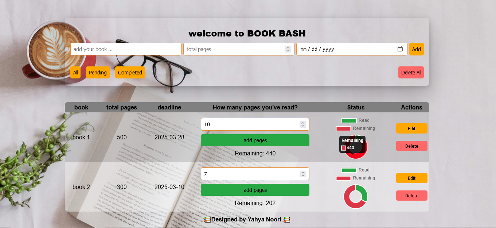

# 📚 Book Bash - Reading Management App

Welcome to **Book Bash**, a simple yet powerful web application designed to help you manage your reading list, track your daily progress, and visualize your achievements. Built using **HTML**, **CSS**, and **JavaScript**, this app allows you to stay organized and motivated on your reading journey.

## 🚀 Features

- **Add Books:** Input the book name, total pages, and set a deadline.
- **Track Progress:** Log daily reading progress and monitor remaining pages.
- **Edit & Update:** Modify book details anytime.
- **Status Filters:** Filter books by status: *All*, *Pending*, or *Completed*.
- **Delete Options:** Remove individual books or clear the entire list.
- **Visual Charts:** Interactive doughnut charts to visualize reading progress using **Chart.js**.
- **Persistent Data:** All data is saved in **localStorage**, so you won't lose your books even after refreshing the page.

## 🖼️ Demo

 *(Add a screenshot of the app here)*

## 🛠️ Technologies Used

- **HTML5** for structuring the app
- **CSS3** for responsive and clean styling
- **JavaScript (ES6+)** for dynamic interactions
- **Chart.js** for data visualization
- **LocalStorage API** for persistent data management

## 📋 How to Use

1. **Clone the Repository:**
   ```bash
   git clone https://github.com/your-username/book-bash.git
   ```

2. **Navigate to the Project Folder:**
   ```bash
   cd book-bash
   ```

3. **Open the App:**
   Simply open the `index.html` file in your preferred browser.

## ⚡ Key Functionalities

- **Adding a Book:** Fill in the book name, total pages, and deadline, then click **Add**.
- **Editing a Book:** Click **Edit** next to the book, update details, and save.
- **Tracking Pages:** Enter the number of pages read daily and click **Add Pages**.
- **Deleting Books:** Click **Delete** for individual books or **Delete All** to clear the list.
- **Filtering:** Use the filter buttons (*All*, *Pending*, *Completed*) to view books based on their status.

## 📊 Visual Progress with Chart.js

The app uses **doughnut charts** to represent how many pages you've read versus how many remain. This gives a quick overview of your reading habits.

## 🚩 Future Improvements

- Adding dark mode support
- Export/import book list as JSON or CSV
- Notifications for upcoming deadlines
- User authentication for cloud data sync

## 🙋‍♂️ Author

Developed with ❤️ by **Yahya Noori**.

Feel free to connect with me on [GitHub](https://github.com/your-username).

## 📄 License

This project is licensed under the **MIT License** - feel free to use, modify, and distribute it.

---

*Happy Reading with Book Bash!* 📚✨

